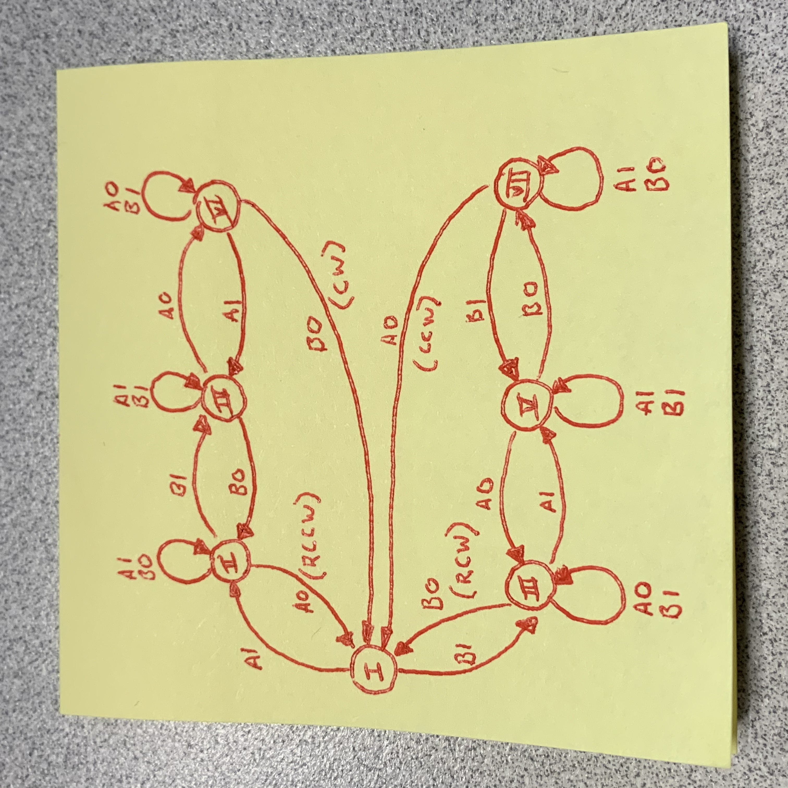

# Rotary Encoder 

Simple knob control.  Good for simple step up / step down rotation where center point is reset on power. 

[](https://www.npmjs.com/package/@johntalton/RotaryEncoder)


[](https://www.npmjs.com/package/@johntalton/RotaryEncoder)


Uses spec defined state machine to validate control and give accurate and consistant output (see bellow).

Also includes push down / up button functionality (click like events)

[Adafruit Rotary Encoder](https://www.adafruit.com/product/377)

## client

simple mqtt client to stream a set of encoder event

## dependency

```onoff``` currently used.  

## state machine 

implementation uses a simple state machines as seen below with events of CW CCW RCW and RCCW.


